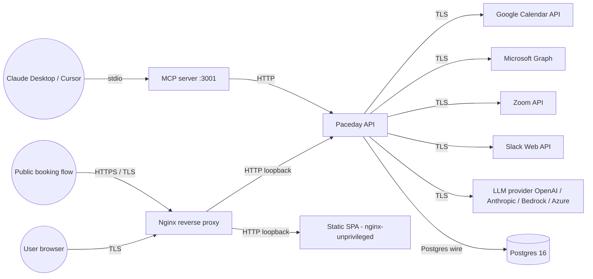

# Security — Paceday

Threat model and security posture for the Paceday system. Updated when any of: a new external boundary is introduced, a new auth/authz path is added, a new data class is stored, or a new privileged operation is exposed. Reviewed quarterly.

Owner: security-engineer skill (see workspace `AGENT_TEAM.md`).

## 1. Assets

| Asset | Sensitivity | Notes |
|---|---|---|
| **OAuth tokens** (Google, Microsoft, Zoom) | **Critical** | Long-lived refresh tokens; per-user since migration 017. Used to read/write the user's calendar on their behalf. |
| **JWT session cookie** | **Critical** | HS256-signed (`backend/auth/jwt.go`); `Secure: true` / `HttpOnly: true` in production. Compromise = full account takeover until expiry. |
| **Calendar event data** | **High** | Meeting titles, attendees, locations, descriptions. May include confidential meeting agendas. |
| **User profile** (email, name, org) | **Medium** | Email is the join key for SSO and bookings. |
| **Settings** (LLM API keys, SMTP creds, Slack tokens, AWS/GCP profiles) | **High** | Stored in plaintext in the `settings` table. Anyone with DB access reads these. |
| **Scheduling links + bookings** | **Medium** | Publicly bookable via slug; booker email becomes part of the calendar event. |
| **Manager / team metadata** | **Medium** | Org structure, 1:1 cadence, missed-meeting analytics. |
| **Audit log** (`audit_log` table) | **Low** | Append-only record of focus_created and similar events. |

## 2. Trust boundaries

Trust boundaries (numbered for STRIDE table below):

1. **B1 — Browser → Edge**: TLS at nginx. Termination point for all user HTTPS traffic.
2. **B2 — Edge → Backend / Frontend**: Loopback HTTP inside docker-compose network.
3. **B3 — Backend → Postgres**: SQL on the compose network. No TLS at rest in dev; production should enable.
4. **B4 — Backend → 3rd-party APIs**: Google, MS, Zoom, Slack, LLM — TLS, OAuth or API-key auth.
5. **B5 — MCP server → Backend**: HTTP on `:3001` inside the compose network. Currently no auth — MCP-side enforcement deferred (see §6 risks).
6. **B6 — Claude → MCP**: stdio, runs as the user — implicit trust.
7. **B7 — Anonymous booker → Public booking**: unauthenticated; mitigated by per-slug rate limit + booker-email confirmation flow.

## 3. STRIDE per boundary

| Boundary | Spoofing | Tampering | Repudiation | Information disclosure | Denial of service | Elevation of privilege |
|---|---|---|---|---|---|---|
| **B1 (Browser→Edge)** | Phishing of paceday.* domain (out of scope; rely on registrar + HSTS — note `docs/security.md` follow-up: nginx HSTS still missing per arch review §7). | TLS at edge. | HTTP access logs at nginx. | TLS prevents passive sniff. | Rate-limit at nginx (not yet configured; arch review §7). | n/a |
| **B2 (Edge→Backend)** | Compose-network isolation — only nginx exposes ports. | Loopback only. | Backend `loggingMiddleware` logs method+path+latency (status not captured; tracked as a follow-up). | n/a | Per-process timeouts. | n/a |
| **B3 (Backend→DB)** | DB password in compose env; rotated via secret-store in prod (out of scope for the agent team; documented as a follow-up). | Parameterized queries throughout — verified by arch review (§5 of the report). | DB-level audit log via `audit_log` table (`storage.WriteAuditLog`). | At-rest encryption is left to the host. | Postgres `max_connections` + pool config in `storage.Open`. | Single DB role used by the app; not least-privileged. Tracked. |
| **B4 (Backend→3rd-party)** | OAuth flow with state cookie (currently missing `Secure: true` on the `oauth_state` cookie — arch review item; follow-up). | TLS + JWT/OAuth bearer at each provider. | Calls logged but not centralized. | Tokens never logged at info+; logging redaction utility to be added (arch review item §12 — structured logging). | Per-provider rate-limit per-user; aggressive retries currently absent. | Tokens scoped per user since migration 017 + PR #35. |
| **B5 (MCP→Backend)** | **No authentication.** `MCP_AUTH_TOKEN` env var exists but is optional. *This is the largest open gap.* See §6. | HTTP only on loopback. | Backend logs all access. | Same as B2. | Same as B2. | MCP carries full backend privileges — a compromised MCP client = full account. |
| **B6 (Claude→MCP)** | Stdio under the user's local account — trusted by definition. | n/a | n/a | n/a | n/a | n/a |
| **B7 (Anon→Booking)** | None possible (anonymous). | Server-side validation of booking time vs availability. | Booking creates a calendar event traceable to the booker email. | Slugs are random base32; can't be enumerated. | **Rate limit per slug currently absent** — open follow-up. | Booking can write to host's calendar — bounded by per-link window. |

## 4. Authentication & authorization

- **JWT** (HS256) issued by `backend/auth/jwt.go` on successful OAuth. Cookie `auth_token`; `HttpOnly`, `SameSite=Lax`, `Secure` in production.
- **JWT_SECRET** is now a hard fail at startup (PR #7).
- **Token scoping**: every `oauth_tokens` row keyed by `(user_id, calendar_id)` since migration 017. Handlers resolve userID from ctx via `auth.UserIDFromContext`; `auth.LoadUserToken(db, uuid.Nil)` returns `ErrNoUser` — no silent legacy fallback.
- **Cron paths**: per-user iteration since PR #35. Each cron tick scopes ctx with `auth.UserIDKey` before any storage call.
- **SSO/OIDC**: per-org SSO via `backend/auth/sso_detect.go` + `oidc.go`; `oauth_state` cookie is the CSRF token.
- **CORS**: `corsMiddleware` reflects exact origin when `ALLOWED_ORIGIN` set; falls back to wildcard without `Allow-Credentials` when unset (safer default; cookies don't propagate).
- **CODEOWNERS**: `@Enach` (single-owner repo; review requirement satisfied by agent-team verdicts).

## 5. Data lifecycle

- **OAuth tokens**: rotated by `golang.org/x/oauth2` library; `UpsertUserToken` writes the new tokens on each refresh.
- **JWT**: 7-day expiry (verify in `auth/jwt.go`); rotated on `/api/auth/me` heartbeat.
- **Calendar event data**: not persisted server-side; fetched on demand from Google/MS APIs and cached for the request lifetime only.
- **Settings**: persistent; LLM API keys and SMTP creds in plaintext (acceptable for single-tenant; tracked for at-rest encryption in production hardening).
- **Audit log**: never purged; size growth tracked.
- **Dependabot**: daily for npm/pip/docker/gh-actions; patch/minor auto-merge on green CI; major bumps closed for manual triage.

## 6. Top open risks (ranked by severity × exposure)

1. **🔴 MCP server has no built-in auth** (B5). `MCP_AUTH_TOKEN` is optional. Any process on the docker-compose network can call any MCP tool. Mitigation: require `MCP_AUTH_TOKEN` to start the server (fatal on empty, mirror of JWT_SECRET fix in PR #7). Anytype task to be filed.

2. **🟠 oauth_state cookie missing `Secure: true`** (B4). On plain HTTP an attacker on the wire can pin state. `handlers_auth.go:25–37`. Mitigation: set `Secure: true` always (or gated on `RUNTIME_ENV=production` env). Anytype task to be filed.

3. **🟠 nginx production config lacks TLS / HSTS / CSP / rate-limit** (B1, B7). Tracked in arch review §7; deferred by user.

4. **🟠 LLM provider API keys + SMTP creds in plaintext `settings` columns** (asset). Tracked for at-rest encryption with libsodium/age or `pgcrypto`.

5. **🟡 No rate limit on `/api/book/{slug}` slot fetch + booking POST** (B7). Easily abused for slot-enumeration or denial. `handlers_booking.go`.

6. **🟡 Single DB role for the app — not least-privileged**. Reads + writes use the same credentials. Read-only replica role would harden analytics/recap paths.

7. **🟡 `loggingMiddleware` doesn't capture status code** (B2). Limits incident response — can't tell 200 from 500 in the access log.

8. **🟡 No `Secure` flag on the demo / mock-mode flags in `sessionStorage`** (frontend). Low impact (booleans, not secrets) but documented.

## 7. Out of scope (and why)

- Physical security of the self-hosted runners and the production server (assumed trusted infra).
- Supply-chain attacks against `bun`/`go install`/`docker` registries (mitigated via lockfile pinning + Trivy scanning).
- Frontend code-injection from third-party scripts: no analytics or 3rd-party scripts are loaded.
- HSM-grade secret protection: out of scope for v1; tracked separately.

## 8. Review cadence

- **Every PR touching `backend/auth/`, `backend/api/middleware.go`, or any `*token*` storage**: security-engineer must approve.
- **Every PR adding a new external API or boundary**: re-validate the STRIDE table; update §3 if a new row is needed.
- **Quarterly walk-through** (Jan / Apr / Jul / Oct) — security-engineer revisits §6 and re-ranks.
- **Dependabot HIGH/CRITICAL CVE**: 24h SLO; tracked in `security-engineer` skill.

## 9. References

- ADR-0001 (`docs/adr/0001-tech-stack.md`): existing conventions.
- ADR-0002 (`docs/adr/0002-frontend-source-of-truth.md`): frontend in standalone repo.
- ADR-0003 (`docs/adr/0003-per-user-cron-iteration.md`): cron + storage per-user.
- Architecture review (this session): full backend + frontend + infra audit.
- `backend/auth/context.go`: where the userID context key lives.
- `backend/storage/migrations/017_*.sql`: oauth_tokens per-user-per-calendar.
- `backend/storage/migrations/018_*.sql`: settings + personal_calendars per-user backfill.
